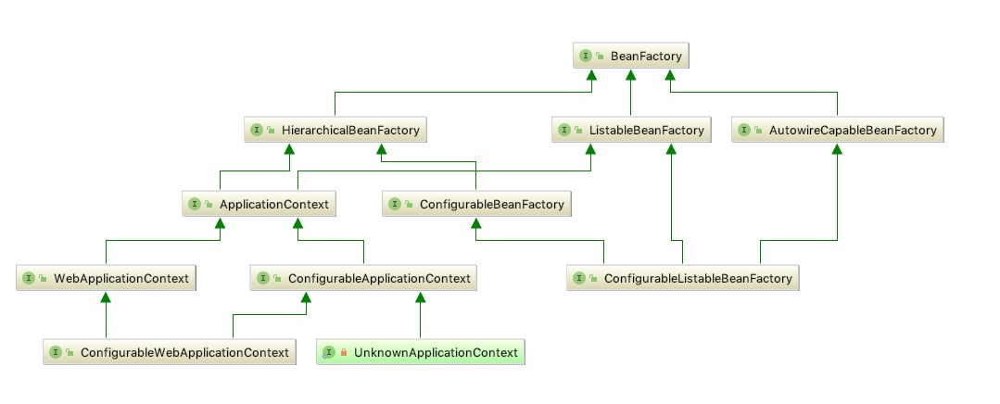

# 概览

Spring的上下文管理都是通过BeanFactory来实例化的，以下是Spring BeanFactory的UML图

## 1 BeanFactory

Spring容器的根接口，制定了Bean的基础能力

此接口由包含许多bean定义的对象实现，每个bean定义由String名称唯一标识。 根据bean定义，工厂将返回包含对象的独立实例（Prototype设计模式）或单个共享实例（Singleton设计模式的高级替代，其中实例是范围中的单例 工厂）。 将返回哪种类型的实例取决于bean工厂配置：API是相同的。 从Spring 2.0开始，根据具体的应用程序上下文（例如Web环境中的“请求”和“会话”范围），可以使用更多的范围。

建议使用setter方法完成数据的注入，同时鼓励Spring Bean之间的引用关系

BeanFactory是接口，提供了OC容器最基本的形式，给具体的IOC容器的实现提供了规范，

ApplicationContext接口,它由BeanFactory接口派生而来，ApplicationContext包含BeanFactory的所有功能，通常建议比BeanFactory优先

